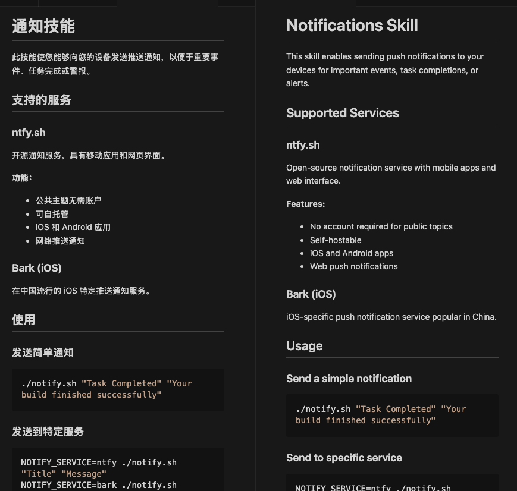

# Rosetta Mark

AI-powered Markdown translation VS Code extension with context awareness and incremental updates.


## Features

- **Multi-Provider Support**: Works with OpenAI, Google Gemini, Anthropic Claude, and Ollama (local)
- **BYOK (Bring Your Own Key)**: Your API keys stay secure in VS Code's SecretStorage
- **Context-Aware Translation**: Preserves code blocks, frontmatter, and formatting
- **Incremental Translation**: Hash-based caching to avoid re-translating unchanged documents
- **Split View Preview**: Automatically opens translation side-by-side with source
- **Streaming Support**: Real-time progress feedback during translation

## Setup

### 1. Install the Extension

Install from VS Code Marketplace or download the `.vsix` file.

### 2. Set Your API Key

Open Command Palette (`Cmd+Shift+P` / `Ctrl+Shift+P`) and run:
```
Rosetta Mark: Set API Key
```
Enter your API key. It will be securely stored in VS Code's SecretStorage.

### 3. Configure Global Settings

You can configure Rosetta Mark globally (for all projects) in two ways:

#### Option A: Settings UI (Recommended)

1. Open VS Code Settings:
   - **Mac**: `Cmd+,`
   - **Windows/Linux**: `Ctrl+,`
   - Or: `Cmd+Shift+P` → "Preferences: Open Settings (UI)"

2. Search for "Rosetta Mark" in the search bar

3. Configure your preferences:
   - **Provider**: Choose your AI provider (OpenAI, Google, Anthropic, Ollama)
   - **Model**: Set the model name
   - **Target Language**: Set your default translation language
   - **Preview Mode**: Choose how to display translations
   - **Max Concurrency**: Control parallel translation speed
   - **Glossary**: Add custom terminology mappings

#### Option B: settings.json (Advanced)

1. Open settings.json:
   - `Cmd+Shift+P` → "Preferences: Open User Settings (JSON)"

2. Add your configuration:
```json
{
  "rosettaMark.provider": "openai",
  "rosettaMark.model": "gpt-4o-mini",
  "rosettaMark.targetLanguage": "zh-CN",
  "rosettaMark.previewMode": "preview",
  "rosettaMark.maxConcurrency": 3,
  "rosettaMark.glossary": [
    {
      "source": "API",
      "target": "应用程序接口",
      "caseSensitive": false
    }
  ]
}
```

> **💡 Tip**: For project-specific settings, create `.vscode/settings.json` in your project root. Project settings override global settings.

## Configuration

### Available Settings

| Setting | Type | Default | Description |
|---------|------|---------|-------------|
| `rosettaMark.provider` | string | `openai` | AI provider: `openai`, `google`, `anthropic`, `ollama`, `openrouter` |
| `rosettaMark.model` | string | `gpt-4o-mini` | Model name (e.g., `gpt-4o-mini`, `claude-3-5-sonnet-20241022`) |
| `rosettaMark.targetLanguage` | string | `zh-CN` | Target language code (e.g., `zh-CN`, `en`, `ja`, `es`) |
| `rosettaMark.baseUrl` | string | `""` | Custom API base URL (for proxies or OpenAI-compatible APIs) |
| `rosettaMark.previewMode` | string | `preview` | Display mode: `editor` (split view), `preview` (split view), or `both` (editor + preview) |
| `rosettaMark.maxConcurrency` | number | `3` | Max parallel translations (1-10) |
| `rosettaMark.glossary` | array | `[]` | Custom terminology for consistent translation |

### Glossary Configuration

Add custom terminology to ensure consistent translations:

```json
{
  "rosettaMark.glossary": [
    {
      "source": "frontend",
      "target": "前端",
      "caseSensitive": false
    },
    {
      "source": "API",
      "target": "应用程序接口",
      "caseSensitive": true
    }
  ]
}
```

## Usage

### Quick Start

1. Open a Markdown file
2. Click the globe icon 🌐 in the editor toolbar, or
3. Use keyboard shortcut: `Cmd+Shift+T` (Mac) / `Ctrl+Shift+T` (Windows/Linux)
4. Or open Command Palette and run `Rosetta Mark: Translate Markdown`

### Translation Process

The extension will:
- ✅ Check if translation is needed (using file hash)
- 🔄 Translate the content while preserving formatting
- 💾 Save to `.rosetta-mark/` directory
- 👀 Open the translation in a split view



### Advanced Features

**Batch Translation**: Right-click on a folder in Explorer and select "Batch Translate" to translate multiple files at once.

**Selection Translation**: Select any text and use `Cmd+Alt+T` (Mac) / `Ctrl+Alt+T` (Windows/Linux) to translate only the selected portion.

**Reverse Translation**: Open a translated file and click the reverse arrow icon to translate back to the source language.

## Translation Cache

All translations are stored in `.rosetta-mark/` directory in your workspace, maintaining the same directory structure as your source files. The extension tracks file hashes to detect changes and only re-translates when necessary.

## Supported Providers

### OpenAI
```json
{
  "rosettaMark.provider": "openai",
  "rosettaMark.model": "gpt-4o-mini"
}
```

### Google Gemini
```json
{
  "rosettaMark.provider": "google",
  "rosettaMark.model": "gemini-2.0-flash-exp"
}
```

### Anthropic Claude
```json
{
  "rosettaMark.provider": "anthropic",
  "rosettaMark.model": "claude-3-5-sonnet-20241022"
}
```

### Ollama (Local)
```json
{
  "rosettaMark.provider": "ollama",
  "rosettaMark.model": "llama3.2",
  "rosettaMark.baseUrl": "http://localhost:11434/v1"
}
```

## Troubleshooting

### Common Issues

**"API Key not set" error**
- Run `Rosetta Mark: Set API Key` from Command Palette
- Make sure you're using the correct API key for your selected provider

**Translation fails with timeout**
- Try increasing the timeout in settings (coming soon)
- For large files, use batch translation with lower concurrency

**Formatting lost after translation**
- Make sure your markdown is valid
- Code blocks should have language identifiers
- Report formatting issues on GitHub

**Rate limit errors**
- Reduce `maxConcurrency` setting to 1 or 2
- Wait a few minutes before retrying
- Consider using a different provider

## Development

```bash
# Install dependencies
pnpm install

# Compile
pnpm run compile

# Watch mode
pnpm run watch

# Run tests
pnpm test

# Lint
pnpm run lint

# Format code
pnpm run format
```

## Contributing

Contributions are welcome! Please read our [Contributing Guide](CONTRIBUTING.md) first.

## License

MIT - see [LICENSE](LICENSE) file for details

---

**Made with ❤️ by [seewhyme](https://github.com/seewhyme)**

*If this extension helps you, please consider [⭐ starring the repo](https://github.com/seewhyme/rosetta-mark)!*
